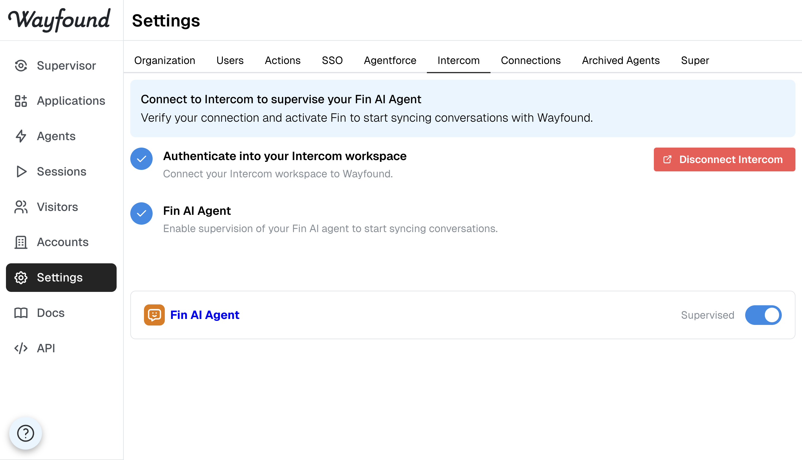

# Connecting to Intercom

#### Connect your Intercom workspace

In Wayfound, go to Settings > Intercom and click Connect to Intercom. You'll be redirected to Intercom to authorize access, then returned to Wayfound automatically.

#### Activate Fin Integration

Once connected, you'll see your Fin AI Agent listed. Toggle the Supervised switch to start monitoring. Wayfound will begin syncing your Fin conversations automatically every 15 minutes.

<figure><figcaption></figcaption></figure>
