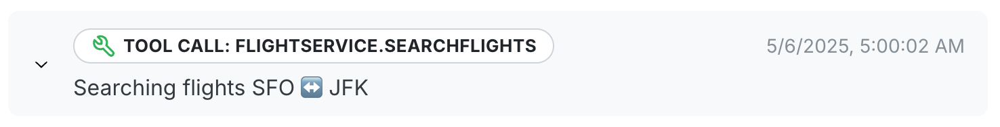
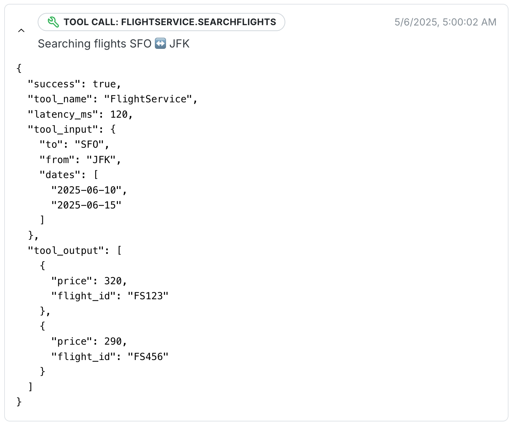

# Connecting Tool Calls

After [connecting-agents.md](connecting-agents.md "mention") to Wayfound, you can also connect tool call information. This allows Wayfound to track tool call success rates in  [performance.md](../manager/performance.md "mention") reports. You can do so by adding a "tool\_call" event to "messages":

```json
{
    "timestamp": "2025-05-07T10:00:03Z",
    "event_type": "tool_call",
    "label": "Tool Call: FlightService.SearchFlights",
    "description": "Searching for flights from SFO to JFK",
    "attributes": {
        "success": true,
        "tool_name": "FlightService",
        "latency_ms": 120,
        "tool_input": {
          "to": "SFO",
          "from": "JFK",
          "dates": [
            "2025-06-10",
            "2025-06-15"
          ]
        },
        "tool_output": [
          {
            "price": 320,
            "flight_id": "FS123"
          },
          {
            "price": 290,
            "flight_id": "FS456"
          }
        ]
      }
}
```

This will add the following information to the agent's Wayfound session transcript:

<figure><figcaption></figcaption></figure>

Clicking the arrow will reveal the details of the tool call event:

<figure><figcaption></figcaption></figure>

Note that tool calls should be logged regardless of success or failure for accurate performance tracking.
