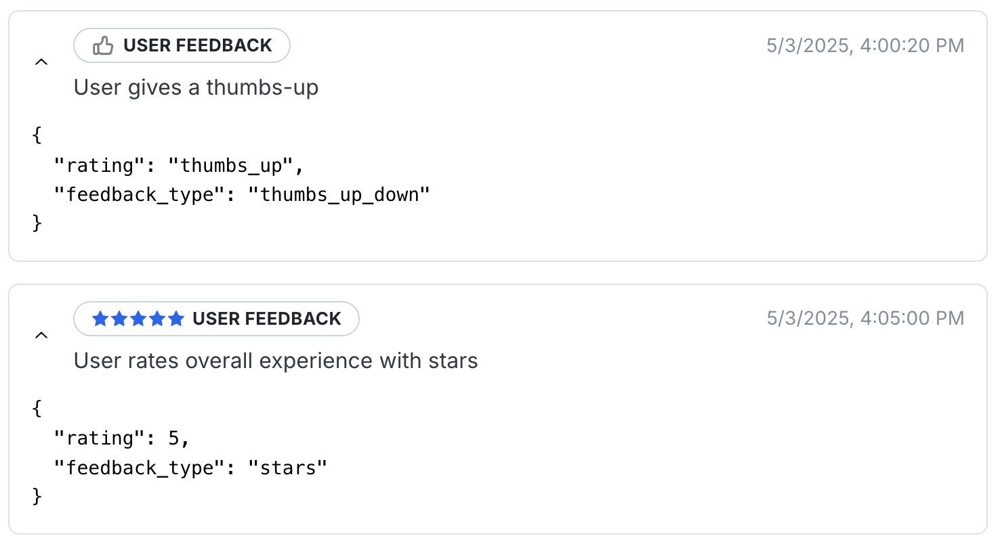

# Connecting User Feedback

After [connecting-agents.md](connecting-agents.md "mention") to Wayfound, you can also track user feedback ratings. This allows Wayfound to generate satisfaction metrics in [performance.md](../supervisor/performance.md "mention") reports. You can do so by adding a "user\_feedback" event to "messages". Two types of user feedback are supported: "stars" and "thumbs\_up\_down":

```json
{
    "timestamp": "2025-05-07T10:05:05Z",
    "event_type": "user_feedback",
    "label": "User Feedback (Thumbs)",
    "description": "User gave a thumbs-up on risk report",
    "attributes": {
      "feedback_type": "thumbs_up_down",
      "rating": "thumbs_up",
      "comment": "This was great!"
    }
  },
  {
    "timestamp": "2025-05-07T10:05:10Z",
    "event_type": "user_feedback",
    "label": "User Feedback (Stars)",
    "description": "User rated overall experience",
    "attributes": {
      "feedback_type": "stars",
      "rating": 5
    }
}
```

Examples of user feedback events are shown here as they appear in a session transcript:

<figure><figcaption></figcaption></figure>

Note that multiple feedback entries can be included for the same conversation, and feedback can be submitted at any point during or after the interaction.
