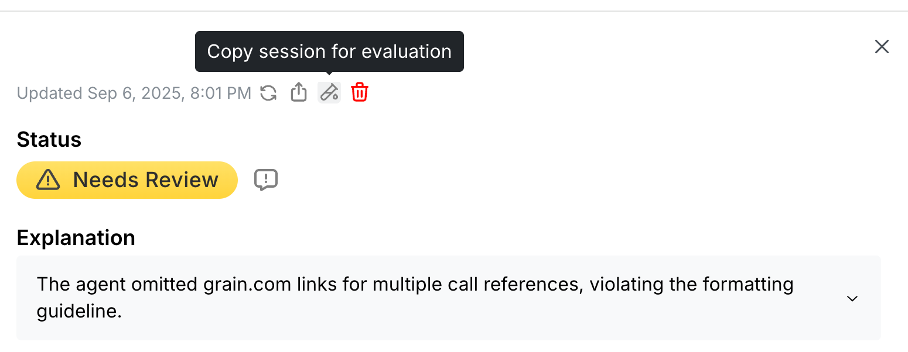

# Test Mode

Test Mode is a sandbox where you can test agent settings with the Wayfound Supervisor to ensure the settings meet your expectations.

The Wayfound Supervisor takes into account your agent’s role, goal, and guidelines when analyzing sessions.  Test Mode enables you to test your agent settings with the Wayfound Supervisor before publishing the settings to your production environment.

### **Setup Overview**

#### 1. Select test sessions

These are sessions that are the primary content of your test runs.  Test sessions can be uploaded via the [Test Session API](https://wayfound-api.readme.io/reference/create-test-session) to facilitate testing before your agent is in production.  You can also copy production sessions to become test sessions when you are managing an agent already released to production.

#### **2. Set expected outcomes on test sessions**

Specify for each guideline what your expected compliance status is for that guideline.  It’s important to select sessions that have both compliant and non-compliant expected values to ensure the guideline language works for both cases.

#### **3. Start test run**

Select the sessions you want to test and specify the number of iterations to run each session.

The more iterations you select the longer the analysis will take but you will also be able to test the stability of the guideline.  Stability is important because the Wayfound Supervisor is conducting a probabilistic analysis of the guideline and you want to ensure that the analysis of the test sessions/guideline is converging to your expected outcome.

### **Select Test Sessions**

When reviewing sessions the session drawer has a “Copy session for evaluation” button which will make a copy of this session and place it into the agent’s sandbox

<figure><figcaption></figcaption></figure>

The session is now listed as a “Test Session” in the Agent’s Test Mode page.

<figure><figcaption></figcaption></figure>

Clicking **View** to review the test sessions

<figure><figcaption></figcaption></figure>

### **Set Expected Outcomes**

For each guideline and test session you can set the expected outcome by clicking on the ‘Test guideline’ button next to the guideline.

<figure><figcaption></figcaption></figure>

This will open a “Guideline Expectations” modal where you can set the expected outcome for each test session for the given guideline.

<figure><figcaption></figcaption></figure>

Repeat this process for each guideline and each test session.

### **Start Test Run**

Select the sessions to test as well as the number of iterations to run. It is suggested to start with a lower number of iterations as you make guideline changes and gradually increase the iterations as the results are aligning with your expectations.

<figure><figcaption></figcaption></figure>

Click “Test Selected” and wait for processing to complete.

<figure><figcaption></figcaption></figure>

When processing is complete you can review the test results.

<figure><figcaption></figcaption></figure>

Note that the **⛶** icon next to the Results tab can open a larger modal.

<figure><figcaption></figcaption></figure>
