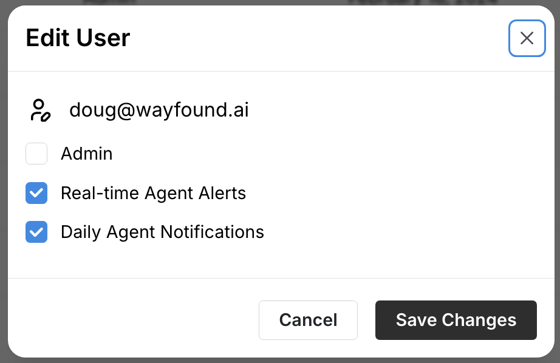

# User Management

Those with admin level permissions can access the Users page in the settings menu. This page displays a table of all users and their statuses. The page also allows you to manage users and their roles in your organization.

<figure><figcaption></figcaption></figure>

### Roles

There are currently two roles on the platform:

**Users** can access the Supervisor, Agents, Sessions, and Visitors pages. They can create and manage agents and use integrations and actions.

**Admins** have all abilities available to users. They can also access their organization's settings, where they can manage users, add or remove actions and integrations, and view API information.

### Adding Users

You can invite new users by clicking  at the top-right corner of the page. Enter the new user's email address in the pop-up window to send them an invitation to join the platform. Check the **Admin** box to give them the admin role. When left unchecked, the user will join the organization as a "user."

### Changing a user's status

To change a user's status on the platform, an admin can click the  edit user button on the right-hand side of the table. This opens the Edit User menu:

<figure><figcaption></figcaption></figure>

Here, you can check or un-check Admin to switch the user's status. You can also toggle whether the user receives real-time and daily agent alerts for agents.
