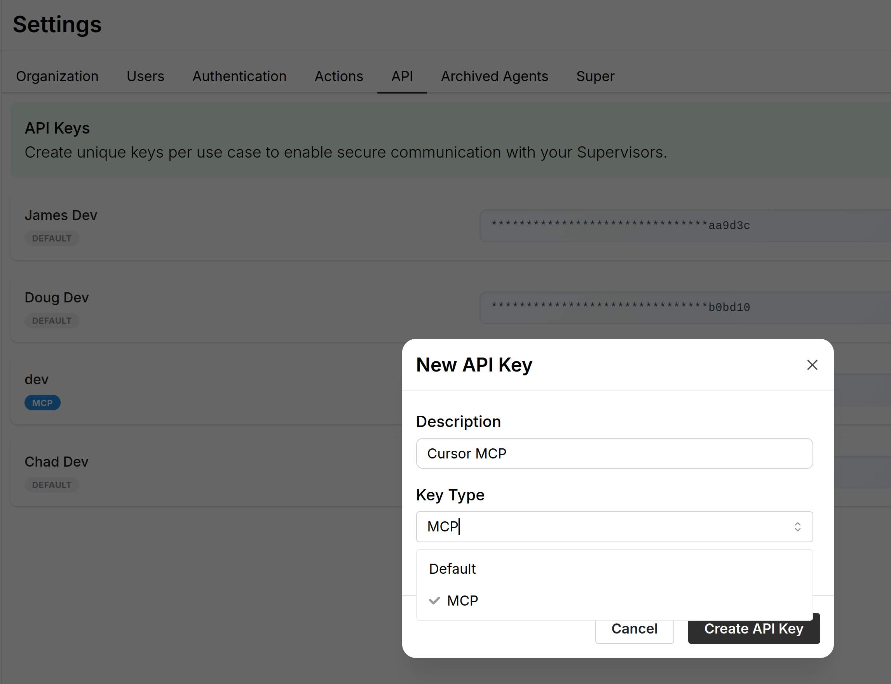

# Report Sharing

Wayfound enables users to share individual agents' Supervisor Reports with audiences outside the platform (with optional password). These reports provide comprehensive performance insights similar to those found in the Supervisor's [performance.md](performance.md "mention") tab.

<figure><figcaption></figcaption></figure>

Shared Supervisor Reports include the AI Supervisor's detailed analysis of agent performance, featuring:

* User satisfaction summaries
* Knowledge gap assessments
* Action failure counts
* Potential issues identified in the past 100 recordings
* Key conversation topics from the past 100 recordings

As in the [performance.md](performance.md "mention") tab, viewers can drill down for more detail by clicking on individual items. Viewers can also open illustrative chat recordings by clicking  next to potential issues.

## How to Share a Report

### 1. Enable the feature

Before users can share Supervisor Reports, an organization's admin user must enable the feature in the [Broken link](broken-reference "mention") page:

<figure><figcaption></figcaption></figure>

The Report Sharing feature is turned off by default. The feature requires administrator opt-in because generating reports creates pages with publicly accessible APIs (with optional password).

### 2. Generate links

Once the feature is enabled, the platform displays share  buttons next to each agent in the [performance.md](performance.md "mention") tab:

<figure><figcaption></figcaption></figure>

Clicking the button opens a pop-up for generating a share link:

<figure><figcaption></figcaption></figure>

Wayfound allows you to protect the manager report with an optional password. To create a password, enter it in the **Password** field and click **Set Password**:

<figure><figcaption></figcaption></figure>

When the password option is active, the shared report requests the password before it displays the manager insights:

<figure><figcaption></figcaption></figure>

Once a share link is generated, you can disable sharing at any time by revisiting the Share Report window. Here, you can also remove the report's optional password if you created one:

<figure><figcaption></figcaption></figure>

## Who can access shared reports?

Without a password, Supervisor Reports can be accessed by anyone who obtains the active share link. We therefore advise caution when creating and sharing the links, as the reports contain agents' performance metrics, selected recordings, and API information. Setting a password allows users greater control over who can view the Supervisor Report. You can reset access to Supervisor Reports by disabling sharing and generating a new link; you can also reset the password while keeping the same link.
