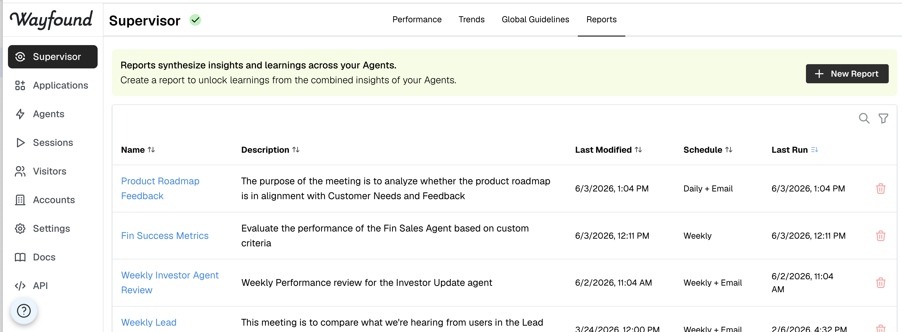

# Reports

Reports let you turn the activity of your agents into insights you can act on.  Instead of digging through individual sessions one agent at a time, you define a Report once - choosing which agents to draw from, what questions to answer, and which metrics to track - and Wayfound assembles the analysis for you cross every session those agents have handled.

Clicking on the Reports tab opens an overview:

<figure><figcaption></figcaption></figure>

### Creating a Report

Click **+ New Report** at the top of the page.  Give the Report a name and description, then choose a starting template:

* **Blank Report:** Start from scratch and build your own agenda from the ground up.
* **Agent Improvement Report:** Comes pre-populated with an agenda focused on surfacing improvement opportunities (knowledge gaps, guideline violations, and suggested fixes) for the agents you selected.

Select **Create Report** to continue to the configuration view.

<figure><figcaption></figcaption></figure>

### Configuring a Report

The detail view is where you define exactly what the Report covers.  You can update any of these settings and re-run the Report at any time.

**Agents.** Choose which agents the Report draws from.  The Report analyzes only the sessions belonging to the agents you select, so this defines the scope.

**Special instructions.** Optional guidance that shapes the tone, focus, and format of the generated insights - for example, "Focus on enterprise customers" or "Keep each answer to three bullet points."

**Timeframe.** Set the data window the Report looks at - last 7, 30, or 90 days, or all time.  This timeframe applies to both the metrics it calculates and the sessions it nalyzes, so you can produce a weekly snapshot or a long-term trend from the same Report definition.

**Agenda.** The heart of a Report.  The agenda is a list of items the Report works through each time it runs.  There are two kinds of agenda items:

* **Narrative items.** Free-form questions or topics written in plain language (e.g. "What are the most common reasons contact support?").  Wayfound analyzes the relevant sessions and writes back a narrative answer, with links to the specific session it drew from so you can verify and dig deeper.
* **Metric items.** Quantitative KPIs that are calculated deterministically from your session data (Covered in **Metrics** below)

You can mix narrative and metric items freely in a single agenda.

<figure><figcaption></figcaption></figure>

### Metrics

Metrics let a Report track quantative KPIs alongside its narrative insights.  Unlike narrative items, metrics are computed deterministically from your session data pre-defined tags.

**How metrics are defined.** Each metrics is built from an **expression** that references the **pre-defined tags** Wayfound applies to your agents' sessions.  For example, if your agent tags sessions as **RESOLVED** and you want a resolution rate, your expression might be: **RESOLVED /** **TOTAL\_SESSIONS**  **\* 100.**

When the Report runs, Wayfound counts how many sessions in the timeframe carry each referenced tag, evaluates the expression, and stores the result.

Each metric has a few settings:

* **Name:** How the metric appears in the Report
* **Expression:** The formula.  Supports tag names, numbers, and the operators +, -, \*, /, and % with parenthesis.  The reserved term **TOTAL\_SESSIONS** refers to the total number of sessions in scope.
* **Format:** How the value is displayed (percentage, whole number, etc)
* **Direction:** Whether higher or lower is better, so the Report can show whether a trend is improving or regressing.

<figure><figcaption></figcaption></figure>

### Scheduling and Email Delivery

A Report can run automatically on a schedule so your team always has a current view without anyone clicking **Run.**

* **Enable scheduling,** then choose a frequency - **daily** or **weekly.**  For weekly schedules, pick the day of the week.  Set the time of day and tiemzones the schedule should follow.
* **Email delivery,** optionally have each scheduled run emailed to one or more recipients.  Ad the email addresses you want to recieve the Report, and Wayfound sends the results as soon as the run completes.

The detail view shows when the Report **last ran** and when it's **next scheduled** to run.

### Running a Report and Viewing Results

To get a fresh read at any time, click **Run** on the Report's detail view.  A Report runs against the latest sessions within its timeframe; **it may take a few minutes to complete.**  Each run is saved to the Report's **History** so you can revisit it later.

The results page presents:

* **Metric titles** for each metric on the agenda, each with its current value and a sparkline.
* **Narrative insights** for each narrative agenda item, written in plain language with links to the sessions they cite.
* **Follow-up chat** on the right-hand side, where you can ask further questions about the results.  The chat continues with the full context of the Report, so you can probe deeper.

<figure><figcaption></figcaption></figure>

<figure><figcaption></figcaption></figure>
